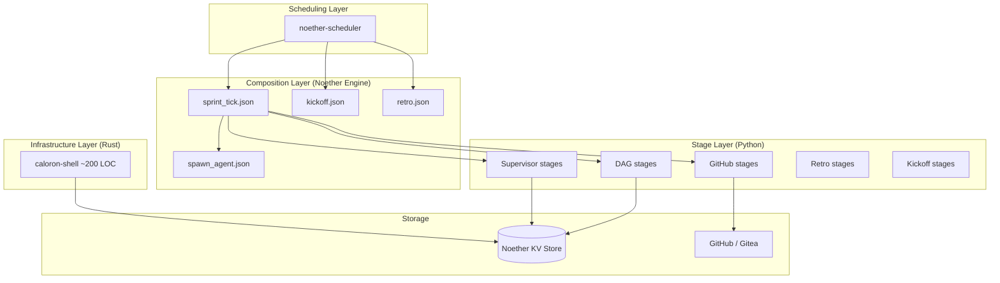

# Architecture

## System Layers



## What Lives Where

| Concern | Original Caloron | Caloron-Noether |
|---------|-----------------|-----------------|
| Orchestration loop | `orchestrator.rs` (404 lines) | `sprint_tick.json` + scheduler |
| State management | `DaemonState` in memory | Noether KV store (SQLite) |
| Event handling | `git/monitor.rs` (680 lines) | `poll_events.py` + `dag_evaluate.py` |
| GitHub API | `git/client.rs` (237 lines) | 5 Python stages (~250 lines) |
| DAG engine | `dag/engine.rs` (627 lines) | `evaluate.py` (~130 lines) |
| Supervisor | 4 Rust files (934 lines) | 3 Python stages (~140 lines) |
| Retro | 5 Rust files (2,083 lines) | 3 Python stages (~170 lines) |
| Process management | `agent/spawner.rs` (336 lines) | `shell/src/spawner.rs` (~100 lines) |
| Heartbeat | Unix socket server (345 lines) | HTTP endpoint (~50 lines) |

## Data Flow: Sprint Tick

```
1. Scheduler triggers sprint_tick.json
2. Parallel: load DagState + last_poll + agents from KV
3. github_poll_events → fetch events since last_poll
4. Save new last_poll to KV
5. dag_evaluate → advance state machine, produce actions
6. Save updated DagState to KV
7. Parallel:
   a. check_agent_health → decide_intervention → supervisor actions
   b. dag_is_complete → check if sprint is done
8. execute_actions → dispatch: spawn agents, merge PRs, post comments
```

## The Shell

The only Rust code. Three HTTP endpoints:

- `POST /heartbeat` — agents report liveness, written to KV
- `POST /spawn` — create git worktree + start harness process
- `GET /status` — list agent PIDs and liveness

The shell does **no business logic** — it only manages OS processes and proxies heartbeats to the KV store.
