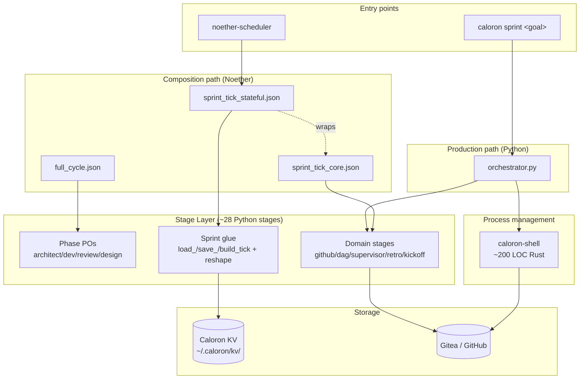

# Architecture

## What runs where (today)



## Two parallel paths

Caloron has two ways to drive a sprint, by design — they target
different operational models and have different maturity.

### `caloron sprint` (Python orchestrator) — production today

`orchestrator/orchestrator.py` is a monolithic Python loop that:

- Calls a PO agent (configured CLI, e.g. `claude`)
- Decomposes a goal into tasks
- Resolves agents via AgentSpec when installed (or HR-agent
  keyword-matching as a fallback)
- Validates `required_skills` declared on each task — blocks if missing
- Spawns each agent in a sandbox (`scripts/sandbox-agent.sh` on Linux,
  `sandbox-passthrough.sh` elsewhere)
- Manages the review cycle (up to 3 cycles before force-merge)
- Persists retro learnings into `learnings.json` for the next sprint
- Talks to Gitea via `docker exec gitea wget`

Every field report so far has come from this path. It's
battle-tested and the right thing to use today.

### Noether composition path — the destination

The composition path expresses the same logic as Noether stages
chained via `Let` bindings and reshape stages. Two flavours:

- **`full_cycle.json`** runs the planning pipeline:
  `design_po → architect_po → dev_po → review_po → phases_to_sprint_tasks`,
  emitting a typed `{tasks: [...]}` ready for the orchestrator (or for
  `caloron sprint --graph` to consume).
- **`sprint_tick_stateful.json`** is the per-tick loop that
  `noether-scheduler` is meant to fire on a cron. Pure composition;
  state persists in `~/.caloron/kv/<sprint_id>.json`.

These type-check end-to-end and individual stages run correctly. Live
end-to-end pilot against a real Gitea is the remaining piece.

## What lives where

| Concern | Implementation |
|---------|----------------|
| Production sprint loop | `orchestrator/orchestrator.py` (Python) |
| Composition-driven sprint loop | `compositions/sprint_tick_stateful.json` (Noether graph) |
| Phase-based planning | `compositions/full_cycle.json` + `stages/phases/*` |
| State persistence | Caloron KV directory (one JSON per sprint) |
| Per-task framework selection | `orchestrator.FRAMEWORKS` registry (claude-code, gemini-cli, codex-cli, opencode, aider, cursor-cli, stub) |
| Process spawning | `caloron-shell` (Rust HTTP server, 3 endpoints) |
| Organisation-wide conventions | `caloron/organisation.py` + `~/.caloron/organisation.yml` |
| Required-skill enforcement | `_enforce_required_skills` in `orchestrator.py` |

## Sprint tick — sprint_tick_core data flow

Each tick of `sprint_tick_core.json`:

```
input: { repo, since, token_env, host, state, agents,
         interventions, sprint_id, shell_url, stall_threshold_m }

  ↓ Let { poll: github_poll_events }
  ↓ Let { eval: Sequential[project_poll_to_eval, dag_evaluate] }
  ↓ Let { health: check_agent_health }
  ↓ Let { supervisor: Sequential[project_health_to_intervention,
                                  decide_intervention] }
  ↓ Let { execute_result: Sequential[project_all_to_execute,
                                      execute_actions] }
  ↓ build_tick_output

output: { actions_taken, errors, state, polled_at, interventions }
```

Each `Let` binding accumulates outputs into the body's scope under the
binding name; reshape stages between Sequential steps realign data so
each domain stage sees its own narrow input shape via structural
subtyping. See [Compositions](compositions.md) for why this design over
the alternatives.

## The shell

Three HTTP endpoints (`POST /heartbeat`, `POST /spawn`, `GET /status`)
in ~200 lines of Rust. No business logic — only OS-process management
and proxying heartbeats. See [Shell API](../reference/shell-api.md).
