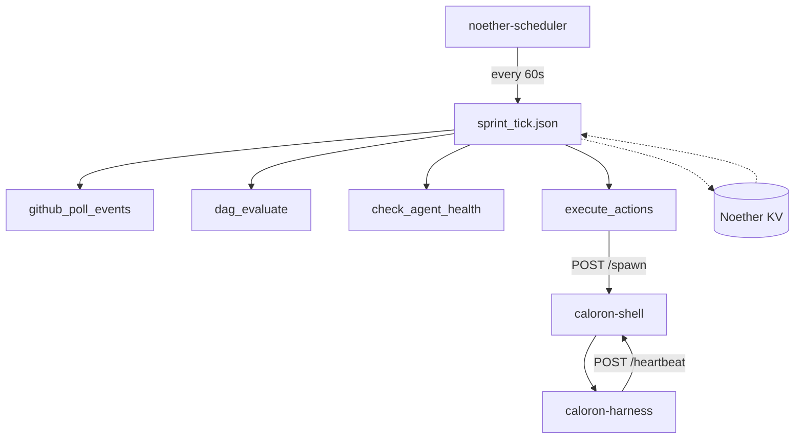

# Caloron-Noether

**Multi-Agent Orchestration via Noether Composition Graphs**

Caloron-Noether is a reimplementation of the [Caloron](https://github.com/alpibrusl/caloron) orchestration platform where all business logic is expressed as [Noether](https://github.com/alpibrusl/solv-noether) composition graphs. The only native code is a ~200-line Rust HTTP server for process management.

## Why This Exists

The original Caloron is ~9,300 lines of Rust. About 65% is business logic (event handling, DAG evaluation, supervisor decisions, retro analysis) that maps naturally to **typed, content-addressed, effect-tracked pipelines** — which is exactly what Noether provides.

```
Original Caloron          →  Caloron-Noether
─────────────────            ─────────────────
9,300 lines Rust             ~1,200 lines (Python + Rust shell)
Hand-written event loop      noether-scheduler (cron)
In-memory DaemonState        Noether KV store (SQLite)
Custom type system           Noether structural typing
Manual caching               Pure-stage output cache
```

## How It Works



1. **noether-scheduler** runs `sprint_tick.json` every 60 seconds
2. The composition graph polls GitHub, evaluates the DAG, checks health, and dispatches actions
3. **caloron-shell** manages agent processes (spawn/kill) and receives heartbeats
4. All state lives in the **Noether KV store** — no in-memory state to lose

## Quick Start

```bash
# 1. Build Noether CLI
cd ../solv-noether && cargo build -p noether-cli
export PATH="$PWD/target/debug:$PATH"

# 2. Register custom stages
./register_stages.sh

# 3. Build the shell
cargo build -p caloron-shell

# 4. Start the shell
./target/debug/caloron-shell &

# 5. Run a sprint tick manually
noether run compositions/sprint_tick.json \
  --input '{"sprint_id": "test", "repo": "owner/repo", "stall_threshold_m": 20}'

# 6. Or start the scheduler for continuous operation
noether-scheduler --config scheduler.json
```

## Stage Overview

| Category | Stages | Effects | Lines |
|----------|--------|---------|-------|
| DAG | evaluate, is_complete, validate | Pure | ~240 |
| GitHub | poll_events, create_issue, post_comment, add_label, merge_pr | Network | ~250 |
| Supervisor | check_health, decide_intervention, compose_message | Pure | ~140 |
| Retro | collect_feedback, compute_kpis, write_report | Pure/Network | ~170 |
| Kickoff | fetch_repo_context, generate_dag | Network/LLM | ~100 |
| **Total** | **16 stages** | | **~900** |

All stages start as Python. When schemas stabilize, they can be promoted to Rust via `InlineRegistry` — zero graph changes needed.
